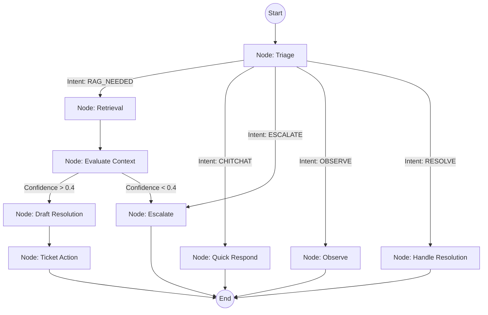

# Backend Architecture & Agent Logic

This document explains the production-ready redesign of the AI Support Backend, powered by FastAPI, LangGraph, and ChromaDB.

## 🧠 LangGraph Architecture
The core of the agent is a directed graph (`app/agent/graph.py`) that manages the state of the conversation and routes the user's request through specialized nodes.

### 1. The Graph Flow

### 2. Node Explanations
*   **Triage**: Uses `gpt-4o-mini` to classify the user's intent, sentiment, and extract metadata filters (e.g., `OS=Windows`).
*   **Retrieval**: Performs a semantic search in ChromaDB using OpenAI embeddings.
*   **Evaluate Context**: Critically assesses if the retrieved KB articles actually answer the user's specific question.
*   **Draft Resolution**: Uses the "Brain" model (`gpt-4o`) to write a professional response based *strictly* on the provided context.
*   **Ticket Action**: Analyzes the conversation to decide if a ticket should be created, updated, or resolved.
*   **Escalate**: Hand-off to a human agent when the AI is unsure or the user is frustrated.
*   **Observe**: A "silent" mode used when a human agent has already joined the chat.
*   **Handle Resolution**: Closes the ticket when a user confirms the issue is fixed (e.g., "Thanks, it works!").

---

## 🔍 RAG Service (`app/services/rag_service.py`)
The Knowledge Base (KB) uses **ChromaDB** for vector storage.

*   **Hybrid Filtering**: The search uses "Soft Metadata Filtering." If the Triage node extracts a constraint (like `Tags`), we filter the vector search results by that metadata to increase precision.
*   **Safety**: We only allow filtering on known keys (`category`, `tags`, etc.) to prevent errors if the LLM hallucinates a filter key.
*   **Reindexing**: The system automatically reindexes `storage/kb/seed_data.json` on startup if the database is missing.

---

## 📡 Real-Time Observability
We use **WebSockets** (`app/core/websockets.py`) to broadcast granular agent status updates to the frontend.

*   **Events**: `AGENT_ANALYZING`, `AGENT_SEARCHING_KB`, `AGENT_TYPING`.
*   **Steps**: Every logic step is recorded as an `AgentStep` in the database, allowing admins to see the AI's internal reasoning (Triage output, Confidence score, etc.).

---

## ⚙️ Performance Optimization (LLM Tiering)
We use different models to balance cost and speed:
1.  **Fast Tier (`gpt-4o-mini`)**: Used for Triage, Evaluation, and Classification.
2.  **Reasoning Tier (`gpt-4o`)**: Used for the final Drafting phase where quality matters most.

---

## 🛠️ Database Schema (`app/db/models.py`)
We added advanced fields to support AI metrics:
*   **Tickets**: `sentiment_score`, `category_id`, `duplicate_of`.
*   **Messages**: `token_count`, `llm_latency_ms`, `confidence_score`.
*   **AgentSteps**: Stores the raw JSON input/output for every AI node execution.
